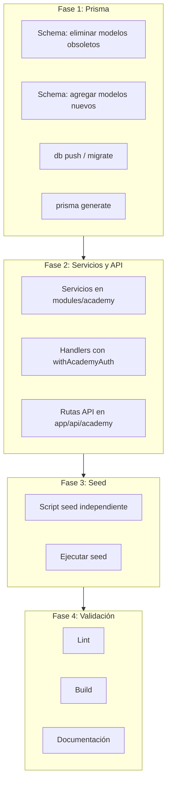

# Guía de Implementación: Módulo KaledAcademy en SaaS Multi-Tenant

Esta guía documenta paso a paso cómo integrar un módulo de academia (bootcamp) en una plataforma SaaS multi-tenant existente. Sirve como plantilla para replicar el patrón en otros productos verticales (ej. otro SaaS, otro bootcamp).

---

## Resumen del flujo



---

## Fase 1: Prisma Schema

### 1.1 Eliminar modelos obsoletos

Si el proyecto tenía modelos anteriores (ej. `AcademyLessonTask`, `AcademyTaskCompletion`):

- Eliminar los modelos del `schema.prisma`
- Eliminar relaciones inversas en `AcademyLesson` y `User` que los referencien

### 1.2 Agregar modelos nuevos

Integrar los modelos del módulo academia. Ejemplo de modelos típicos:

| Modelo | Propósito |
|--------|-----------|
| `AcademyLessonMeta` | Metadata de sesión: semana, día, analogía, intro |
| `AcademyCRALChallenge` | Retos CRAL (Construir/Romper/Auditar/Lanzar) |
| `AcademyCRALCompletion` | Completado de reto por estudiante |
| `AcademyQuiz` / `AcademyQuizOption` / `AcademyQuizResult` | Quizzes de verificación |
| `AcademyDeliverable` / `AcademyDeliverableItem` / `AcademyDeliverableSubmission` | Entregables semanales |
| `AcademyKaledSession` | Contexto para chat con tutor IA |
| `AcademyBadge` / `AcademyBadgeEarned` | Gamificación |
| `AcademySaasProject` / `AcademySaasUpdate` | Proyecto SaaS del estudiante |
| `AcademyDemoDayResult` | Resultado de defensa final |

**Importante:** Todos los modelos que almacenan datos por tenant deben tener `tenantId String` y relación con `Tenant`.

### 1.3 Enums necesarios

```prisma
enum SessionType { TEORIA, PRACTICA, LIVE, ENTREGABLE }
enum DayOfWeek { LUNES, MIERCOLES, VIERNES }
enum CRALPhase { CONSTRUIR, ROMPER, AUDITAR, LANZAR }
enum BadgeCondition { LESSONS_COMPLETED, DELIVERABLES_APPROVED, ... }
```

### 1.4 Comandos

```bash
npx prisma db push    # o migrate dev si usas migraciones
npx prisma generate
```

---

## Fase 2: Servicios y API

### 2.1 Estructura de carpetas

```
src/
├── modules/
│   └── academy/
│       ├── services/
│       │   └── academy.service.ts   # Lógica de negocio
│       ├── api/
│       │   └── handlers.ts          # Handlers que usan withAcademyAuth
│       └── config/
│           └── roles.ts             # ACADEMY_ROLES, INSTRUCTOR_ROLES
└── app/
    └── api/
        └── academy/
            ├── courses/route.ts
            ├── lessons/[id]/route.ts
            ├── quizzes/[quizId]/answer/route.ts
            ├── cral/[challengeId]/complete/route.ts
            ├── deliverables/[deliverableId]/submit/route.ts
            ├── cohorts/active/route.ts
            ├── ai/kaled/route.ts
            └── ...
```

### 2.2 Patrón de autenticación

Todas las rutas API deben usar un wrapper que valide:

1. Usuario autenticado
2. Usuario pertenece al tenant de la academia
3. Usuario tiene rol permitido (ACADEMY_STUDENT, ACADEMY_TEACHER, ACADEMY_ADMIN)

Ejemplo de handler:

```ts
// handlers.ts
export async function getLessonHandler(
  request: Request,
  user: User,
  tenantId: string,
  context?: { params: { id: string } }
) {
  const lessonId = context?.params?.id ?? context?.params?.lessonId;
  const lesson = await courseService.getLessonWithProgress(lessonId, tenantId, user.id);
  return NextResponse.json(lesson);
}
```

```ts
// app/api/academy/lessons/[id]/route.ts
export const GET = withAcademyAuth(getLessonHandler);
```

### 2.3 Rutas API implementadas

| Ruta | Método | Descripción |
|------|--------|-------------|
| `/api/academy/courses` | GET | Bootcamp del tenant |
| `/api/academy/courses/[id]/sidebar` | GET | Módulos con progreso |
| `/api/academy/lessons/[id]` | GET | Lección con meta, quizzes, CRAL, entregables |
| `/api/academy/lessons/[id]/complete` | POST | Marcar lección completada |
| `/api/academy/lessons/[id]/video` | POST | Progreso de video |
| `/api/academy/quizzes/[quizId]/answer` | POST | Responder quiz |
| `/api/academy/cral/[challengeId]/complete` | POST | Completar reto CRAL |
| `/api/academy/deliverables/[deliverableId]/submit` | POST | Entregar |
| `/api/academy/deliverables/[submissionId]/review` | POST | Revisar (instructor) |
| `/api/academy/cohorts/active` | GET | Cohorte activa |
| `/api/academy/cohorts/[id]/ranking` | GET | Ranking de estudiantes |
| `/api/academy/cohorts/[id]/analytics` | GET | Métricas de cohorte |
| `/api/academy/projects` | GET/POST | Proyecto SaaS del estudiante |
| `/api/academy/ai/kaled` | POST | Chat con Kaled (streaming) |
| `/api/academy/badges` | GET | Badges del estudiante |
| `/api/academy/demo-day/[projectId]/result` | GET/POST | Resultado Demo Day |

### 2.4 Servicios principales

- `courseService`: cursos, módulos, lecciones, sidebar
- `progressService`: completar lección, progreso de video
- `quizService`: responder quiz, resultados
- `cralService`: completar retos CRAL
- `deliverableService`: entregables, revisiones
- `cohortService`: cohorte activa, ranking, analytics
- `saasProjectService`: proyecto SaaS del estudiante
- `badgeService`: badges ganados
- `kaledAIService`: chat con tutor IA (streaming)

---

## Fase 3: Seed

### 3.1 Script independiente

Crear `prisma/seed-kaledacademy.ts` como script separado para no mezclar con el seed principal.

### 3.2 Orden de creación

1. Tenant (upsert por slug)
2. Roles (ACADEMY_ADMIN, ACADEMY_TEACHER, ACADEMY_STUDENT)
3. Usuarios demo (admin, instructor, estudiantes)
4. Curso principal
5. Cohorte
6. Matrículas (enrollments)
7. Badges
8. Módulos y sesiones (con meta, CRAL, quiz, entregables)
9. Memorias del agente Kaled (AgentMemory)

### 3.3 Tipado

- Usar `BadgeCondition` de `@prisma/client` en lugar de `as any`
- Definir interfaz `SesionSeed` para el array de sesiones
- Prefijar variables no usadas con `_` (ej. `_userInstructor`)

### 3.4 Script en package.json

```json
"db:seed-kaledacademy": "npx tsx prisma/seed-kaledacademy.ts"
```

### 3.5 Ejecución

```bash
npm run db:seed-kaledacademy
```

---

## Fase 4: Validación

### 4.1 Build

```bash
npm run build:vercel
```

O el comando de build estándar del proyecto.

### 4.2 Lint

```bash
npm run lint
```

Corregir errores en archivos creados/modificados:

- `@typescript-eslint/no-explicit-any` → usar tipos explícitos
- `@typescript-eslint/no-unused-vars` → prefijo `_` o eliminar

### 4.3 Checklist final

- [ ] Prisma schema sin conflictos
- [ ] `prisma generate` exitoso
- [ ] Seed ejecuta sin errores
- [ ] Build exitoso
- [ ] Lint sin errores en archivos del módulo

---

## Adaptación a otro SaaS

Para replicar este patrón en otro producto:

1. **Schema:** Definir modelos con `tenantId` en todos los que almacenen datos por tenant.
2. **Tenant:** Crear tenant con slug único (ej. `mi-saas-vertical`).
3. **Roles:** Definir roles específicos del módulo.
4. **Servicios:** Agrupar lógica en `src/modules/<nombre>/services/`.
5. **API:** Rutas bajo `/api/<nombre>/` con wrapper de auth por tenant.
6. **Seed:** Script independiente `prisma/seed-<nombre>.ts`.

---

## Archivos clave del proyecto

| Archivo | Descripción |
|---------|-------------|
| `prisma/schema.prisma` | Modelos Academy* con tenantId |
| `src/modules/academy/services/academy.service.ts` | Servicios |
| `src/modules/academy/api/handlers.ts` | Handlers API |
| `src/modules/academy/config/roles.ts` | Roles de academia |
| `src/app/api/academy/**/route.ts` | Rutas API |
| `prisma/seed-kaledacademy.ts` | Seed del bootcamp |

---

## Referencias

- [ARQUITECTURA.md](../nuevaInfraKaledacademy/ARQUITECTURA.md) — Diseño original de KaledAcademy
- [TENANT_AUTENTICACION_E_INVITACIONES.md](TENANT_AUTENTICACION_E_INVITACIONES.md) — Multi-tenancy en KaledSoft
