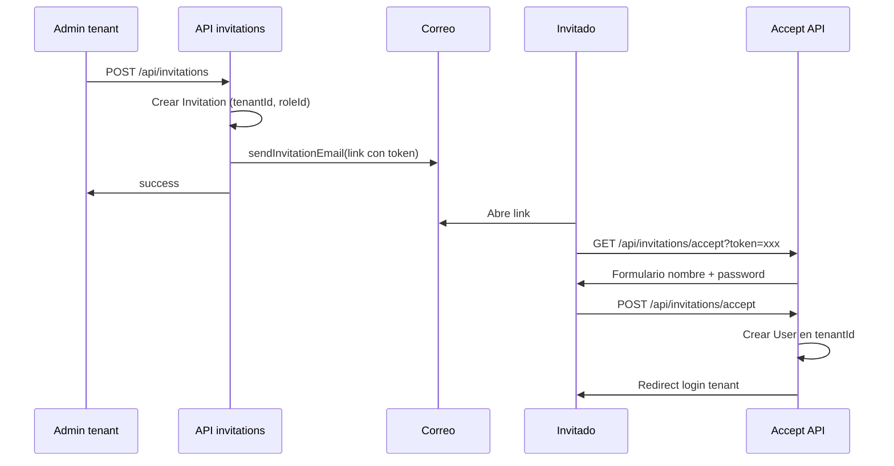

# Autenticación e invitaciones por tenant

> Patrón estándar que aplica a **todos los tenants**. Cada tenant tiene implementado por defecto el mismo flujo de autenticación e invitación de usuarios.

---

## Alcance

- **Autenticación:** Login en el subdominio del tenant, sesión única, APIs protegidas con `withTenantAuth`.
- **Invitaciones:** Crear invitación desde el tenant, enviar correo con enlace, el invitado acepta y se crea el usuario en ese tenant; redirección al login del tenant.

Este flujo es **agnóstico al tipo de tenant** (Academia, Edutec, etc.). Productos concretos (ej. Kaled Academy) añaden roles o UIs específicas sobre el mismo patrón.

---

## Autenticación

### URL de login

- **Producción:** `https://{slug}.kaledsoft.tech/auth/login`
- **Desarrollo:** `http://{slug}.localhost:3000/auth/login`

El tenant se identifica por el subdominio (`slug`). El middleware añade el header `x-tenant-slug` a las peticiones.

### Flujo

- Un solo flujo de credenciales para todos los tenants (mismo formulario y misma lógica de verificación).
- La sesión se guarda en cookie (`session_token`); **no** se guarda el tenant en la cookie.
- El tenant activo se determina por: subdominio de la petición y/o `user.tenantId` del usuario autenticado.
- Las APIs de tenant usan `withTenantAuth`: validan sesión y que el usuario pertenece al tenant (por header o por `user.tenantId`).

### Archivos clave

- Login: `src/app/auth/login/page.tsx` (o ruta equivalente por contexto).
- Auth: `src/lib/auth.ts`, `src/modules/auth/actions.ts`.
- Protección API: `src/lib/api-auth.ts` → `withTenantAuth`, `withTenantAuthAndCSRF`.

---

## Invitaciones

### Crear invitación

- **Quién:** Un usuario del tenant con rol que tenga permiso (p. ej. Administrador) y con `invitationLimit` > 0.
- **API:** `POST /api/invitations`
- **Body:** `{ email, roleId, inviterId }`. Opcional: `academyRole` para tenants tipo Academia (ACADEMY_STUDENT, ACADEMY_TEACHER, ACADEMY_ADMIN).
- **Efecto:** Se crea un registro `Invitation` con `tenantId`, token único y fecha de expiración (p. ej. 7 días). Se envía un correo con el enlace de aceptación.

### Correo

- El enlace apunta a la base URL del tenant: `https://{slug}.kaledsoft.tech/auth/invitation/{token}` (o equivalente en desarrollo).
- Implementación: `sendInvitationEmail()` en `src/lib/email.ts`; recibe `tenantSlug` y construye la URL.

### Aceptar invitación

- **Página:** `/auth/invitation/[token]`
- **Flujo:**
  1. `GET /api/invitations/accept?token=xxx` — valida el token y devuelve datos de la invitación (institución, email, rol).
  2. El invitado completa nombre y contraseña en el formulario.
  3. `POST /api/invitations/accept` con `{ token, name, password }` — crea el usuario en el `tenantId` de la invitación, marca la invitación como aceptada y redirige al login del tenant.

El usuario creado queda asociado al tenant; puede iniciar sesión en el subdominio de ese tenant.

### Dónde se invita desde la UI

- **Estándar:** En el tenant, **Configuración > Usuarios** (pestaña Usuarios), botón **"Invitar Usuario"** (abre `InviteUserModal`).
- **Por producto:** Algunos tenants (ej. Kaled Academy) pueden exponer además su propia pantalla (ej. Academia > Usuarios) usando la misma API de invitaciones.

### Requisito

El usuario que invita debe tener **`invitationLimit` > 0**. Ese valor se puede asignar al crear el tenant (admin inicial) o después desde SuperAdmin (gestión de usuarios del tenant).

---

## Diagrama del flujo de invitación

---

## APIs involucradas

| Método | Ruta | Uso |
|--------|------|-----|
| GET | `/api/invitations` | Listar invitaciones del tenant (opcional `inviterId`) |
| POST | `/api/invitations` | Crear invitación y enviar correo |
| GET | `/api/invitations/accept?token=xxx` | Validar token y obtener datos para el formulario |
| POST | `/api/invitations/accept` | Aceptar invitación y crear usuario en el tenant |

Todas las rutas de invitación están protegidas por tenant (o son públicas con token en el caso de accept). Ver `src/app/api/invitations/route.ts` y `src/app/api/invitations/accept/route.ts`.

---

## Relación con otros documentos

- **Crear y gestionar tenants:** [MULTI_TENANCY.md](MULTI_TENANCY.md) — cómo se crea un tenant y que el admin inicial tenga límite de invitaciones por defecto.
- **Aislamiento y guards:** [TENANT_ISOLATION.md](TENANT_ISOLATION.md) — uso de `withTenantAuth` y filtrado por `tenantId`.
- **Admin vs tenant:** [ARQUITECTURA_ADMIN_VS_TENANT.md](ARQUITECTURA_ADMIN_VS_TENANT.md) — separación de contexto admin y tenant.
- **Academia:** Kaled Academy usa este mismo patrón; ver [ACADEMIA_BASE_IMPLEMENTADA.md](ACADEMIA_BASE_IMPLEMENTADA.md) y [PLAN_INVITACION_CREACION_ESTUDIANTES.md](PLAN_INVITACION_CREACION_ESTUDIANTES.md).
